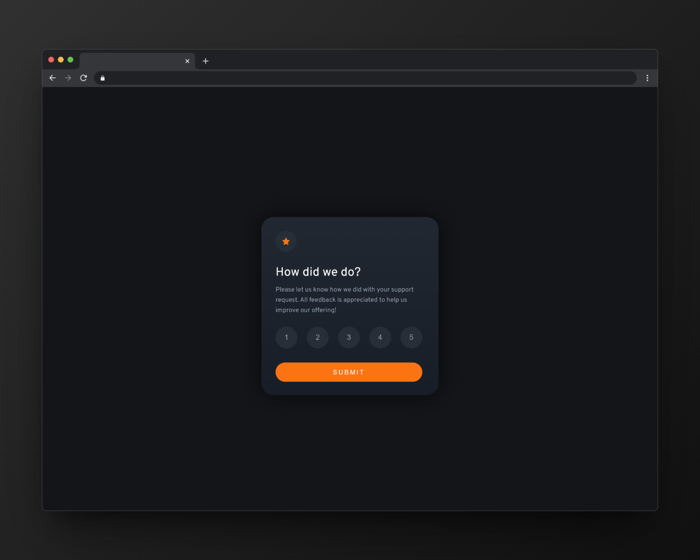

#  Interactive rating component

This small project was created using React, TypeScript and Vite.js, a fast and modern build tool for web projects.

## Getting Started

To get started with the project, you'll need to use the following scripts:

### Development Server

To start the development server, run:
```
pnpm run dev
```
This command starts a local development server with hot module replacement, allowing you to see your changes in real-time as you edit your code.
### Build for Production

To start the development server, run:
```
pnpm run build
```
This command bundles your application into static files for production. It optimizes the output for the best performance.
### Preview Production Build

To start the development server, run:
```
pnpm run preview
```
This command serves the files generated from the build command locally, allowing you to inspect the production build and ensure it works as expected before deploying.

# Frontend Mentor - Interactive rating component solution

This is a solution to the [Interactive rating component challenge on Frontend Mentor](https://www.frontendmentor.io/challenges/interactive-rating-component-koxpeBUmI). Frontend Mentor challenges help you improve your coding skills by building realistic projects. 

## Overview

### The challenge

Users should be able to:

- View the optimal layout for the app depending on their device's screen size
- See hover states for all interactive elements on the page
- Select and submit a number rating
- See the "Thank you" card state after submitting a rating

### Screenshot




### Links

- Solution URL: [Repository Github here](https://github.com/GonzaloGC/interactive-rating-component-main)
- Live Site URL: [Deploy at Vercel here](https://interactive-rating-component-gg.vercel.app/)

### Built with

- Semantic HTML5 markup
- Flexbox
- Mobile-first workflow
- [React](https://reactjs.org/) - JS library
- [TypeScript](https://www.typescriptlang.org/) - JavaScript with syntax for types
- [Vite js](https://vitejs.dev/) - Next Generation Frontend Tooling

## Author

- Frontend Mentor - [@GonzaloGC](https://www.frontendmentor.io/profile/GonzaloGC)
- Twitter - [@gonzaloelias](https://twitter.com/gonzaloelias)
